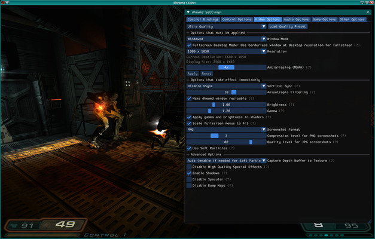
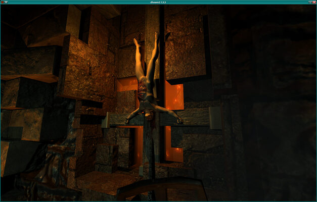
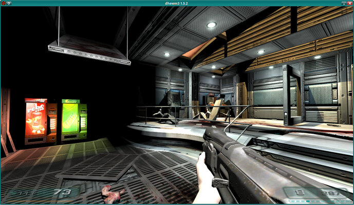

# About

**dhewm3** is a source port of the original Doom3 (**not** *Doom3 BFG*, for that you may want to
try [RBDoom3BFG](https://github.com/RobertBeckebans/RBDOOM-3-BFG/)).
It's known to work on Windows, Linux, macOS, [FreeBSD](https://freebsd.org),
[OpenBSD](https://openbsd.org) and [AROS](http://www.aros.org/),
but it should work on (or be easily portable to) any system that supports OpenGL 1.4 with
[ARB shaders](https://en.wikipedia.org/wiki/ARB_assembly_language),
[SDL](http://libsdl.org) and [OpenAL](http://openal.org).  
Compared to the original version of Doom3, dhewm3 has many bugfixes, supports EAX-like sound effects on
all operating systems and hardware (via [OpenAL Softs](http://openal-soft.org/) EFX support), has much
better support for widescreen resolutions and has 64bit support.

It only supports **old Mods** if they *either* don't require their own game DLL *or* have been ported to
dhewm3 - see the [Mods page](./mods.html) for more information.  

Note that while the Doom3 source code has been released under GPL, you still need to legally own the
game and provide dhewm3 the game data to play. See the [How to Install](#how-to-install) section for
more information.

# News

#### 2026-01-11: _dhewm3 1.5.5 Release Candidate 1_

A first Release Candidate of the upcoming 1.5.5 release is available!

You can **[download it at Github](https://github.com/dhewm/dhewm3/releases/tag/1.5.5_RC1)**
(incl. builds for Windows and 64bit Linux).

There have been lots of changes (see below for details), one highlight is that several sources of
microstutters have been removed (like the old 60 vs 62.5fps problem) so the game should run
smoother than before, especially when using VSync.

Another great new feature is the support for widescreen GUIs. It requires adjusting the .ui files;
*Arl* created versions for the base game, Resurrection of Evil and The Lost Mission, they are provided
as an optional [Download](https://github.com/dhewm/dhewm3/releases/tag/1.5.5_RC1) (dhewm3-wide-guis-\*.zip).

**dhewm3-mods** contains some new mods:

* [ELDOOM](https://www.moddb.com/mods/eldoom/downloads/eldoom-v10)
* [Grimm](https://www.moddb.com/mods/grimm-quest-for-the-gatherers-key)
* [HeXen: Edge Of Chaos Demo](https://www.moddb.com/games/doom-iii/downloads/hexen-edge-of-chaos-dhewm3-edition)
* [Real Gibs](https://www.moddb.com/games/doom-iii/addons/real-gibs-v106-for-dhewm3-32-bit)
    - Note: The page says it only works with the 32bit version of dhewm3, but that refers to the realgibs.dll **they** ship.  
      Use their gamedata with the .dll/.so provided here (or build the lib yourself)
* [Blood Mod](https://www.moddb.com/mods/blood-mod/downloads/blood-mod-v18) has been updated to v1.8
* All mods (except for LibreCoop) got updated with gamecode changes from dhewm3 1.5.5

**Changes since 1.5.4:**

* Enable/disable Soft Particles when **loading** a graphics quality preset (only enabled in Ultra preset,
  though you can still configure it independently like before; [#604](https://github.com/dhewm/dhewm3/issues/604))
* Greatly improve precision of internal timing, which should eliminate micro stutters
  (that were esp. noticeable when using VSync with 60Hz displays).  
  Related: `com_showFPS` is now more precise and `com_showFPS 2` shows additional information
* Support BC7-compressed (BPTC) .dds textures. They offer better quality than the older S3TC/DXT/BC1-3
  texture compression standard that Doom3 always supported. Mostly relevant for high-res retexturing
  packs, because they offer similar quality as uncompressed TGAs while being smaller, using only
  a quarter of the VRAM (TGA: 4 bytes per pixel, BC7: 1 byte per pixel) and loading *significantly*
  faster because mipmaps are contained and don't have to be generated on load.  
  If you have such DDS files and want to use them (instead of TGAs), you must set
  `image_usePrecompressedTextures 1` and `image_useNormalCompression 2`.  
  You can also set `image_usePrecompressedTextures 2`, then dhewm3 will only load .dds textures
  with BC7 data - if it only finds an old one (with S3TC/DXT/BC-13 compression) it will use the 
  uncompressed TGA textures instead.  
  If you want to *create* .dds files with BC7 texture data, you can use any common texture compression
  tool, **except** for **normalmaps**, those must be created with my
  [**customized bc7enc**](https://github.com/DanielGibson/bc7enc_rdo) with the `-r2a` flag!
  *(Because Doom3 requires that normalmaps have the red channel moved into the alpha channel,
  id confusingly called that "RXGB", and AFAIK no other tool supports that for BC7.)*  
  Just like the old DXT .dds files, they must be in the `dds/` subdirectory of a mod (either directly
  in the filesystem or in a .pk4).
* Allow creating aspect-ratio-independent GUIs (HUD and menus), based on code from
  [CstDoom3](https://www.moddb.com/mods/cstdoom3), but greatly extended ([#324](https://github.com/dhewm/dhewm3/issues/324)).  
  Note that this won't work out of the box with the original Doom3 game data, but requires updated GUIs.
  See [docs/GUIs.md](docs/GUIs.md) for how to use these features when creating GUIs.
* Support SDL3 (SDL2 and, to some degree, SDL1.2 are also still supported)
* Fix bugs on 64bit Big Endian platforms ([#472](https://github.com/dhewm/dhewm3/issues/472), [#625](https://github.com/dhewm/dhewm3/issues/625))
* Fixes for high-poly models (use heap allocation instead of `alloca()` for big buffers; [#528](https://github.com/dhewm/dhewm3/issues/528))
* Fix building dhewm3ded with newer OpenAL Soft headers ([#633](https://github.com/dhewm/dhewm3/issues/633))
* Better support for High-DPI mice:
  - Don't ignore mouse input on fast movement ("ridiculous mouse delta"; [#616](https://github.com/dhewm/dhewm3/issues/616))
  - Allow setting sensitivity to values `< 1` in the dhewm3 settings menu to allow sane speeds
    for looking around with High-DPI mice (otherwise it might be way too fast)
* Fix a crash (assertion) on start with ImGui if `SDL_GetWindowDisplayIndex()`
  or `SDL_GetDisplayDPI()` failed and the `imgui_scale` CVar was set to the default value of `-1`
  (setting it to `1` worked around the bug; [#632](https://github.com/dhewm/dhewm3/issues/632))
* Updated Dear ImGui to 1.91.7
* Fix scaling of Grabber cursor in Resurrection of Evil in non-4:3 resolutions ([#637](https://github.com/dhewm/dhewm3/issues/637))
* Add `com_disableAutoSaves` CVar: If set to `1`, Autosaves (when starting a level) are disabled ([#620](https://github.com/dhewm/dhewm3/issues/620))
* Add support for "nospecular" parm of lights, enabled by setting `"allow_nospecular" "1"` in a maps
  worldspawn, or by setting the `r_allowNoSpecular` CVar to `1`.  
  Note that this required changing the format of demos. dhewm3 can still play old demos, but ones
  recorded with current dhewm3 are not compatible with older dhewm3 versions, original Doom3 or
  other source ports (unless they do the same change).
* Make sure macOS doesn't show popups for key-alternatives when pressing a key for longer while ingame
* Windows: Show error MessageBox if dhewm3log.txt can't be created on startup ([#544](https://github.com/dhewm/dhewm3/issues/544))
* Running a timedemo with sound disabled (`s_noSound 1`) doesn't crash anymore ([#163](https://github.com/dhewm/dhewm3/issues/163))
* Show some OpenGL/GPU information in the *Video Options* tab of the *dhewm3 Settings Menu*
* Fix saving/loading of `idSpring` (`func_spring`) entity ([#31](https://github.com/dhewm/dhewm3/issues/31))
* Fix several issues (incl. crashes and missing shadows) with MD3 models ([#698](https://github.com/dhewm/dhewm3/issues/698))
* Fix the "shrivel" effect of MD5 models (`SHADERPARM_MD5_SKINSCALE`)
* Optionally integrate the [Tracy](https://github.com/wolfpld/tracy) profiler.
  Disabled unless you enable it in CMake.
* Fixed a crash in AI pathfinding code that could happen in the lotsaimps testmap ([#721](https://github.com/dhewm/dhewm3/pull/721))
* Disabled assertion in `TestHugeTranslation()` that led to "crashes" in several user-maps ([#720](https://github.com/dhewm/dhewm3/issues/720))
* Fixed concatenation of timed GUI commands that sometimes lead to glitches in UIs
* Added `fs_gameDllPath` CVar: If set, game DLLs will be searched in that directory before the other
  standard places (like next to the executable). Especially useful for developing/debugging mod DLLs
  (you can just set `fs_gameDllPath` to the build dir, no need to copy the DLL/.so/.dylib)
* Several smaller fixes for all kinds of things incl. build issues
* The Windows build now comes with SDL2 2.32.10, cURL 8.18.0 and OpenAL-Soft 1.25.0

#### 2024-08-03: _dhewm3 1.5.4_

Twenty years ago to the day, Doom 3 was released! 

To celebrate this, dhewm3 1.5.4 is released today!

The biggest new features since 1.5.3 are a new mod-independent **Settings Menu** that uses
[Dear ImGui](https://github.com/ocornut/imgui) and **Soft Particles** (that don't "cut" into geometry
but fade smoothly).  
The *Settings Menu* can be opened by pressing the `F10` key (unless some other action is already
bound to that key) or by entering `dhewm3Settings` in the console and lets you configure many
basic and advanced options, can be navigated with gamepad, keyboard or mouse and has an improved
keybindings menu (compared to the original options menu).

You can **[download it at Github](https://github.com/dhewm/dhewm3/releases/tag/1.5.4)**
(incl. builds for **Windows** and 64bit **Linux**).  
An up-to-date version for **macOS** is available at **[MacSourcePorts.com](http://www.macsourceports.com/sourceport/dhewm3)**.

**NOTE:** On some systems, Soft Particles noticeably **slow down rendering**! If the performance of dhewm3 1.5.4
is worse than you'd expect, try disabling them (`r_useSoftParticles 0` or in the new *Settings Menu*
under  
*Video Options* uncheck &#9744; *Use Soft Particles*).

**Changes since 1.5.3:**

* dhewm3-mods now contains game DLLs/libs for several new mods:
    - [Blood Mod v1.5](https://www.moddb.com/games/doom-iii/addons/blood-mod-v15-for-dhewm3-32-bit)
    - [Perfected Doom3 (ROE) v7](https://www.moddb.com/mods/perfected-doom-3-version-500/downloads)
    - [Sikkmod v1.2](https://www.moddb.com/mods/sikkmod/downloads/sikkmod-v12) and [Sikkmod RoE v1.1](https://www.moddb.com/mods/sikkmod/downloads/sikkmod-v11-roe)
    - See the [Mods section](./mods.html) for more details, and the [dhewm3-sdk repository](https://github.com/dhewm/dhewm3-sdk/)
      for source code
* A brand new **settings menu** that uses [Dear ImGui](https://github.com/ocornut/imgui).  
  Can be opened with `F10` (unless that key is bound already) or by entering `dhewm3Settings`
  in the console. It has lots of settings that the original options menu doesn't have and
  can be easily navigated with gamepad or keyboard (or the mouse, of course).
  It can also be opened while in the game, which then is paused (if Single Player) but still visible,
  so the effect of most graphics settings can be seen immediately.
  Needs SDL2 and C++11.
* **"Soft" Particles** (that don't "cut" into geometry but fade smoothly), based on code from 
  [The Dark Mod](https://www.thedarkmod.com/main/) 2.04. Can be enabled/disabled with `r_useSoftParticles`,
  is applied automatically for all appropriate particles (view-aligned, using additive or alpha
  blending and not too small)
* `r_enableDepthCapture`: Enable capturing depth buffer to texture, needed for the soft particles.
  Can be used in custom materials by using the `"_currentDepth"` texture
* Replaced dependency on (external) zlib with integrated [miniz](https://github.com/richgel999/miniz)
* **HighDPI**/Retina support
* Allow inverted mouse look (horizontally, vertically or both) with `m_invertLook`
* CVar to allow always run in single player (still drains stamina though!): `in_allowAlwaysRunInSP`
* VSync can be enabled/disabled on the fly, without restarting the renderer (still with `r_swapInterval`
  or in the menu, of course; needs SDL2)
* Allow enabling/disabling [HRTF](https://en.wikipedia.org/wiki/Head-related_transfer_function) with `s_alHRTF`
* `s_alOutputLimiter`: Configure OpenAL's output-limiter which temporarily reduces the overall
  volume when too many too loud sounds play at once, to avoid issues like clipping
* `s_scaleDownAndClamp`: Clamp and reduce volume of all sounds to prevent clipping or temporary
  downscaling by OpenAL's output limiter
* If `r_windowResizable` is set, the dhewm3 window (when in windowed mode..) can be freely resized.
  Needs SDL2; with 2.0.5 and newer it's applied immediately, otherwise when creating the window.
* If switching between fullscreen and windowed mode or similar changes causes issues (like [here](https://github.com/dhewm/dhewm3/issues/587#issuecomment-2205807989)), you can set `r_vidRestartAlwaysFull 1`, so (again) a full `vid_restart` is done, instead of the partial one which *usually* suffices for just changing the resolution or fullscreen state. If you run into that issue (probably a driver bug), you'll probably also want to set `r_windowResizable 0`, because resizing the window that way also triggered the bug, and in that case no `vid_restart` is done at all
* Fixed screenshots when using native Wayland (`SDL_VIDEODRIVER=wayland`)
* If you enter the `map` command in the console, without any arguments, the current map name is printed
* Support OpenGL debug contexts and messages (`GL_ARB_debug_output`). Can be enabled with `r_glDebugContext 1`.
   Changing that CVar requires a `vid_restart` (or set it as startup argument)
* In the Win32 release, updated the bundled SDL2 to 2.30.5 and cURL to 8.9.0
* In the dhewm3-mods archive for Linux, the librecoop libs have been rebuild (fix [#589](https://github.com/dhewm/dhewm3/issues/589))

Thank you very much to everyone who tested this, especially @j4reporting, @ALord7, @Eonfge and @tomkidd (who also maintains MacSourcePorts)!

Special thanks to **Valkyries733** from the *idtech 4* Discord server for creating the awesome
picture with the birthday cake!

#### 2024-07-29: _dhewm3 1.5.4 Release Candidate 3_

The third Release Candidate for the upcoming 1.5.4 release is available!

Click to see the rest of this (outdated) newspost

It fixes an issue with the Soft Particles first noticed in Dentonmod, but the way I had to fix it was
kinda intrusive so **testing** would be **very welcome**.

You can **[download it at Github](https://github.com/dhewm/dhewm3/releases/tag/1.5.4_RC3)**
(incl. builds for Windows and 64bit Linux).

*(Note: The mod DLLs haven't changed, so if you want to test the supported mods just use the
dhewm3-mods archive from [1.5.4 RC2](https://github.com/dhewm/dhewm3/releases/tag/1.5.4_RC2))*

#### 2024-07-28: _dhewm3 1.5.4 Release Candidate 2_

The second Release Candidate for the upcoming 1.5.4 release is available!

Click to see the rest of this (outdated) newspost

You can **[download it at Github](https://github.com/dhewm/dhewm3/releases/tag/1.5.4_RC2)**
(incl. builds for Windows and 64bit Linux).

It only has some minor changes:

* Fixed mods menu to support Perfected Doom 3 ROE and Sikkmod RoE (so they automatically get fs_game_base set to d3xp when started from the menu)
* Make entries for base game and Resurrection of Evil (d3xp) in mods menu clearer
* Fixed the Perfected Doom 3 ROE mod (so it actually starts)
* Applied fixes to Perfected Doom 3 and Sikkmod so the crosshair is round in widescreen resolutions

*(see the newspost just below this one for changes since 1.5.3)*

#### 2024-07-27: _dhewm3 1.5.4 Release Candidate 1_

A first Release Candidate of the upcoming 1.5.4 release is available!

Click to see the rest of this (outdated) newspost

The biggest new features since 1.5.3 are a new mod-independent **Settings Menu** that uses
[Dear ImGui](https://github.com/ocornut/imgui) and **Soft Particles** (that don't "cut" into geometry
but fade smoothly).  
The *Settings Menu* can be opened by pressing the `F10` key (unless some other action is already
bound to that key) or by entering `dhewm3Settings` in the console and lets you configure many
basic and advanced options, can be navigated with gamepad, keyboard or mouse and has an improved
keybindings menu (compared to the original options menu).

You can **[download it at Github](https://github.com/dhewm/dhewm3/releases/tag/1.5.4_RC1)**
(incl. builds for Windows and 64bit Linux).

**Changes since 1.5.3:**

* dhewm3-mods now contains game DLLs/libs for several new mods:
    - [Blood Mod v1.5](https://www.moddb.com/games/doom-iii/addons/blood-mod-v15-for-dhewm3-32-bit)
    - [Perfected Doom3 (ROE) v7](https://www.moddb.com/mods/perfected-doom-3-version-500/downloads)
    - [Sikkmod v1.2](https://www.moddb.com/mods/sikkmod/downloads/sikkmod-v12) and [Sikkmod RoE v1.1](https://www.moddb.com/mods/sikkmod/downloads/sikkmod-v11-roe)
    - See the [Mods section](./mods.html) for more details, and the [dhewm3-sdk repository](https://github.com/dhewm/dhewm3-sdk/)
      for source code
* A brand new **settings menu** that uses [Dear ImGui](https://github.com/ocornut/imgui).  
  Can be opened with `F10` (unless that key is bound already) or by entering `dhewm3Settings`
  in the console. It has lots of settings that the original options menu doesn't have and
  can be easily navigated with gamepad or keyboard (or the mouse, of course).
  It can also be opened while in the game, which then is paused (if Single Player) but still visible,
  so the effect of most graphics settings can be seen immediately.
  Needs SDL2 and C++11.
* **"Soft" Particles** (that don't "cut" into geometry but fade smoothly), based on code from 
  [The Dark Mod](https://www.thedarkmod.com/main/) 2.04. Can be enabled/disabled with `r_useSoftParticles`,
  is applied automatically for all appropriate particles (view-aligned, using additive or alpha
  blending and not too small)
* `r_enableDepthCapture`: Enable capturing depth buffer to texture, needed for the soft particles.
  Can be used in custom materials by using the `"_currentDepth"` texture
* Replaced dependency on (external) zlib with integrated [miniz](https://github.com/richgel999/miniz)
* **HighDPI**/Retina support
* Allow inverted mouse look (horizontally, vertically or both) with `m_invertLook`
* CVar to allow always run in single player (still drains stamina though!): `in_allowAlwaysRunInSP`
* VSync can be enabled/disabled on the fly, without restarting the renderer (still with `r_swapInterval`
  or in the menu, of course; needs SDL2)
* Allow enabling/disabling [HRTF](https://en.wikipedia.org/wiki/Head-related_transfer_function) with `s_alHRTF`
* `s_alOutputLimiter`: Configure OpenAL's output-limiter which temporarily reduces the overall
  volume when too many too loud sounds play at once, to avoid issues like clipping
* `s_scaleDownAndClamp`: Clamp and reduce volume of all sounds to prevent clipping or temporary
  downscaling by OpenAL's output limiter
* If `r_windowResizable` is set, the dhewm3 window (when in windowed mode..) can be freely resized.
  Needs SDL2; with 2.0.5 and newer it's applied immediately, otherwise when creating the window.
* If switching between fullscreen and windowed mode or similar changes causes issues (like [here](https://github.com/dhewm/dhewm3/issues/587#issuecomment-2205807989)), you can set `r_vidRestartAlwaysFull 1`, so (again) a full `vid_restart` is done, instead of the partial one which *usually* suffices for just changing the resolution or fullscreen state. If you run into that issue (probably a driver bug), you'll probably also want to set `r_windowResizable 0`, because resizing the window that way also triggered the bug, and in that case no `vid_restart` is done at all
* Fixed screenshots when using native Wayland (`SDL_VIDEODRIVER=wayland`)
* If you enter the `map` command in the console, without any arguments, the current map name is printed
* Support OpenGL debug contexts and messages (`GL_ARB_debug_output`). Can be enabled with `r_glDebugContext 1`.
   Changing that CVar requires a `vid_restart` (or set it as startup argument)
* In the Win32 release, updated the bundled SDL2 to 2.30.5 and cURL to 8.9.0
* In the dhewm3-mods archive for Linux, the librecoop libs have been rebuild (fix [#589](https://github.com/dhewm/dhewm3/issues/589))

#### 2024-03-29: _dhewm3 1.5.3_

Just in time for the Easter weekend, dhewm3 1.5.3 is done!

This brings (the often-requested) support for **gamepads**, as long as they're supported by SDL2.
This includes XBox Controllers (and compatible ones), Playstation 3-5 controllers, Nintendo Switch Pro
Controllers, many thirdparty controllers for those consoles, and lots of other gamepads for PC.  
See the [Configuration documentation](https://github.com/dhewm/dhewm3/blob/master/Configuration.md#using-gamepads)
for how to make make it work (well, basically you can just plug in your gamepad and configure bindings
in the Controls menu, but I also provide configs with default bindings that you could use).  
Furthermore, dhewm3 now supports taking **screenshots in different formats**: TGA (like before), BMP, JPEG and PNG.  
Last but not least, there were several **bugfixes** and other small improvements, see the list below for details.

You can **[download dhewm3 1.5.3 at Github](https://github.com/dhewm/dhewm3/releases/tag/1.5.3)** 
(incl. builds for Windows and 64bit Linux for both dhewm3 **and the [supported mods](./mods.html)**).

**Changes since 1.5.2:**

* Support for gamepads (based on code from [Quadrilateral Cowboy](https://github.com/blendogames/quadrilateralcowboy),
  but heavily expanded). See [Configuration.md](https://github.com/dhewm/dhewm3/blob/master/Configuration.md#using-gamepads)
  for more information.
* Support different file formats for screenshots by setting the `r_screenshotFormat` CVar
  (0 = TGA, still the default, 1 = BMP, 2 = PNG, 3 = JPG). `r_screenshotJpgQuality` and
  `r_screenshotPngCompression` allow configuring how JPG/PNG are compressed.
  Thanks *eezstreet (Nick Whitlock)*!
* Fixed problems with lights after loading a savegame ([#495](https://github.com/dhewm/dhewm3/issues/495))
* Fix volume of some weapon sounds, like chaingun being too quit ([#326](https://github.com/dhewm/dhewm3/issues/326))
* Increase stack size on Windows to 8MB (instead default of 1MB) to make loading huge models work
* Fixed crash in Radiant Model Preview Dialog ([#496](https://github.com/dhewm/dhewm3/issues/496))
* Fix MD3 model support
* Several new CMake options:
    - To enable Clang/GCC Address Sanitizer and Undefined Behavior Sanitizer
    - Hardlink the game code into the executable (instead of using game DLLs,
      only supports base *or* d3xp then; needed for Undefined Behavior Sanitizer)
    - Force colored diagnostic output from GCC or Clang (esp. useful when building with ninja)
* Fix several compiler warnings
* Added build instructions for Linux (and similar systems) to [README.md](https://github.com/dhewm/dhewm3?tab=readme-ov-file#compiling-example-using-ubuntu)
* Added documentation for dhewm3-specific settings (mostly CVars): [Configuration.md](https://github.com/dhewm/dhewm3/blob/master/Configuration.md)
* Updated stb_image and stb_vorbis
* Updated minizip (from zlib/contrib) to latest upstream code
* Added `in_namePressed` CVar to print currently pressed key/button (useful for binding keys
  in the console or configs). Thanks *Biel Bestué de Luna*!
* Probably more bugfixes I forgot to list here..
* Updated bundled libs in build for Windows: OpenAL Soft 1.23.1, SDL 2.30.0, cURL 8.6.0, zlib 1.3.1
* Linux binary build now requires SDL 2.0.12 or newer (I provide an updated `libSDL2-2.0.so.0` though).  
  If you compile dhewm3 yourself, older SDL2 versions (and SDL1.2) are still supported 
  (however, SDL1.2 doesn't support gamepads)

#### 2024-03-19: _dhewm3 1.5.3 Release Candidate 2_

The second release candidate for 1.5.3 fixes a bug with gamepad support (sometimes the gamepad buttons were mixed up after using ingame UI panels) and updates the integrated minizip library.

Furthermore, all the mods have been updated for gamepad support and the bugfixes since 1.5.2.

Download **[dhewm3 1.5.3 RC2 at Github](https://github.com/dhewm/dhewm3/releases/tag/1.5.3_RC2)**
(incl. builds for Windows and 64bit Linux)!

#### 2024-02-04: _dhewm3 1.5.3 Release Candidate 1_

A first Release Candidate of the upcoming 1.5.3 release is available!

Click to see the rest of this (outdated) newspost

This brings support for **gamepads**, as long as they're supported by SDL2. This includes XBox Controllers
(and compatible ones), Playstation 3-5 controllers, Nintendo Switch Pro Controllers, many thirdparty
controllers for those consoles, and lots of other gamepads for PC.  
Furthermore, dhewm3 now supports taking **screenshots in different formats**: TGA (like before), BMP, JPEG and PNG.  
Last but not least, there were several **bugfixes** and other small improvements, see the list below for details.

You can **[download it at Github](https://github.com/dhewm/dhewm3/releases/tag/1.5.3_RC1)**
(incl. builds for Windows and 64bit Linux).

**Changes since 1.5.2:**

* Support for gamepads (based on code from [Quadrilateral Cowboy](https://github.com/blendogames/quadrilateralcowboy),
  but heavily expanded). See [Configuration.md](https://github.com/dhewm/dhewm3/blob/master/Configuration.md#using-gamepads)
  for more information.
* Support different file formats for screenshots by setting the `r_screenshotFormat` CVar
  (0 = TGA, still the default, 1 = BMP, 2 = PNG, 3 = JPG). `r_screenshotJpgQuality` and
  `r_screenshotPngCompression` allow configuring how JPG/PNG are compressed.
  Thanks *eezstreet (Nick Whitlock)*!
* Fixed problems with lights after loading a savegame ([#495](https://github.com/dhewm/dhewm3/issues/495))
* Fix volume of some weapon sounds, like chaingun being too quit ([#326](https://github.com/dhewm/dhewm3/issues/326))
* Increase stack size on Windows to 8MB (instead default of 1MB) to make loading huge models work
* Fixed crash in Radiant Model Preview Dialog ([#496](https://github.com/dhewm/dhewm3/issues/496))
* Fix MD3 model support
* Several new CMake options:
    - To enable Clang/GCC Address Sanitizer and Undefined Behavior Sanitizer
    - Hardlink the game code into the executable (instead of using game DLLs,
      only supports base *or* d3xp then; needed for Undefined Behavior Sanitizer)
    - Force colored diagnostic output from GCC or Clang (esp. useful when building with ninja)
* Fix several compiler warnings
* Probably more bugfixes I forgot to list here..
* Added build instructions for Linux (and similar systems) to [README.md](https://github.com/dhewm/dhewm3?tab=readme-ov-file#compiling-example-using-ubuntu)
* Updated stb_image and stb_vorbis
* Updated bundled libs in build for Windows: OpenAL Soft 1.23.1, SDL 2.30.0, cURL 8.6.0, zlib 1.3.1
* Linux binary build now requires SDL 2.0.12 or newer (I provide an updated `libSDL2-2.0.so.0` though).  
  If you compile dhewm3 yourself, older SDL2 versions (and SDL1.2) are still supported 
  (however, SDL1.2 doesn't support gamepads)

#### 2022-06-13: _dhewm3 1.5.2_

dhewm3 1.5.2 is done.

You can **[download it at Github](https://github.com/dhewm/dhewm3/releases/tag/1.5.2)**
(incl. builds for Windows and 64bit Linux for both dhewm3 **and the supported mods**)

Since dhewm3 1.5.1, there have been a lot of enhancements, like better compatibility with Wayland, or
applying gamma and brightness in shaders, which means that those settings work better on all
platforms and are visible in screenshots (to demonstrate this, the screenshot above has been taken
with `r_gamma 2.0` and `r_brightness 1.9`).  
Furthermore, both keyboard- and mouse-input have been improved and now there are multiple Quicksave
slots (that are cycled through), so if you accidentally saved in a bad situation, you can still load
the previous Quicksave.  
Last but not least, there were lots of bugfixes and the (sadly still Windows-only) tools have been
improved again with nice new features like High-DPI support, 64bit-compatibility and
**the Script Debugger you might remember from Quake4**!

See the following list for more details.

**Changes since 1.5.1:**

* Gamma and Brightness are now applied in the shaders instead of by setting hardware gamma.  
  Can be disabled (so hardware gamma is used again) with `r_gammaInShaders 0`
* Improvements for (Windows-only) MFC-based tools:
    - Added the script debugger! (thanks *HarrievG*!)  
      Original Doom3 didn't have it (Quake4 did), but the Doom3 GPL source contained
      most of it. *HarrievG* implemented the missing parts and we added some new
      features. It can even be used over the network and while the client part
      (the debugger GUI) is Windows-only, the server can run on all supported
      platforms, so you can debug a game running on Linux or macOS, for example.  
      Relevant CVars for network debugging are:
      `com_enableDebuggerServer` and `com_dbgClientAdr` and `com_dbgServerAdr`.  
      To debug the running game on the same PC, just enter `debugger` in the console.
    - All tools can now be built in 64bit (thanks *raynorpat*!)
    - HighDPI support (thanks *HarrievG*!)
    - PDAEditor works now
    - Additional bugfixes
* Cycle through multiple Quicksave slots instead of immediately overwriting the last
  Quicksave. The `com_numQuicksaves` CVar allows setting the number of QuickSaves ([#392](https://github.com/dhewm/dhewm3/issues/392))
* Make r_locksurfaces work ([#357](https://github.com/dhewm/dhewm3/issues/357))  
  It doesn't do exactly what its description and name suggests: it renders
  everything that is *currently* visible from the position/view the player had
  when setting `r_locksurfaces 1`. Originally it was supposed to render exactly
  the surfaces that *were* visible then, but I couldn't get that to work.  
  This is pretty similar, but there may be differences with opened doors and such.
* Keyboard input improvements (mostly SDL2-only):
    - Support (hopefully) all keyboard keys on all kinds of keyboard layouts
      by using scancodes for otherwise unknown keys
    - Support typing in non-ASCII characters, if supported by Doom3 (it supports ISO-8859-1)
    - Support the clipboard also on non-Windows platforms  
      You can paste text from the clipboard into the console or other edit fields
      with `Shift+Insert`
    - Explicit support for Right Ctrl, Alt and Shift keys  
      (can be bound to different actions than their left counterparts)
    - Added `in_grabKeyboard` CVar to make sure dhewm3 gets *all* keyboard input  
      Prevents the Windows-key or Alt-Tab or whatever from taking focus from the game
    - Added `in_ignoreConsoleKey` - if set to `1`, the console is only opened with
      Shift+Esc, and the "console key" (that key between Esc, 1 and Tab) can be freely
      bound to an action (and its char can be typed in the console without closing it).
    - Added (SDL2-only) "auto" option for `in_kbd`: When not disabling the console key,
      dhewm3 will try to automatically detect it if `in_kbd` is set to "auto" (now default)
* Reworked mouse-input and -grabbing code, using absolute mouse mode in fullscreen GUIs
  (except for the PDA, because it's implemented weirdly).  
  This made releasing the mouse in the main menu possible, as now the ingame cursor
  is at the same position as the system cursor.
* `s_alReverbGain` CVar to reduce EFX reverb effect intensity ([#365](https://github.com/dhewm/dhewm3/issues/365))
* Pause (looped) sounds when entering menu ([#330](https://github.com/dhewm/dhewm3/issues/330))
* Fixes for looped sounds ([#390](https://github.com/dhewm/dhewm3/issues/390))
* Replace libjpeg with stb_image and libogg/libvorbis(file) with stb_vorbis
    - Now the only required external dependencies should be OpenAL, SDL, zlib
      and optionally libCURL (and of course the C and C++ runtimes)
* (Optionally) use libbacktrace on non-Windows platforms for more useful
  backtraces in case of crashes (usually linked statically)
* Fixed a deadlock (freeze) on Windows when printing messages from another thread
* Fixed endless loop (game locking up at startup) if graphics settings couldn't be applied ([#386](https://github.com/dhewm/dhewm3/issues/386))
* Fixed some warnings and uninitialized variables (thanks *turol*!)
* Work around dmap bug caused by GCC using FMA "optimizations" ([#147](https://github.com/dhewm/dhewm3/issues/147))
* Prevent dhewm3 from being run as root on Unix-like systems to improve security
* Replaced most usages of `strncpy()` with something safer to prevent buffer overflows
  (remaining cases should be safe).
    - Just a precaution, I don't know if any of them could actually be exploited,
      but there were some compiler warnings in newer GCC versions.
* Console output is now logged to `dhewm3log.txt` (last log is renamed to `dhewm3log-old.txt`)
    - On Windows it's in `My Documents/My Games/dhewm3/`
    - On Mac it's in `$HOME/Library/Application Support/dhewm3/`
    - On other Unix-like systems like Linux it's in `$XDG_DATA_HOME/dhewm3/`
      (usually `$HOME/.local/share/dhewm3/`)
* Improved compatibility with Wayland ([#426](https://github.com/dhewm/dhewm3/issues/426))
* Work around assertion in AlphaLabs4 due to "ride_of_death" yeeting
  the dead "monster_zsec_shotgun_12" into the void ([#409](https://github.com/dhewm/dhewm3/issues/409))
* Support loading some mods known to need `fs_game_base d3xp` via Mods menu
  (currently, *The Lost Mission* and *LibreCoop d3xp* are supported)
* Disable assertion in idSampleDecoderLocal::DecodeOGG() that triggered
  when starting a new Classic Doom3 game ([#461](https://github.com/dhewm/dhewm3/issues/461))

#### 2022-05-29: _dhewm3 1.5.2 Release Candidate 2_

The second Release Candidate of the upcoming 1.5.2 release is available!

Click to see the rest of this (outdated) newspost

You can **[download it at Github](https://github.com/dhewm/dhewm3/releases/tag/1.5.2_RC2)**
(incl. builds for Windows and 64bit Linux for both dhewm3 **and the supported mods**)

**Changes since 1.5.2 Release Candidate 1:**

* Updated the code of all mods hosted in [dhewm3-sdk repository](https://github.com/dhewm/dhewm3-sdk)
  with relevant changes from dhewm3.
* The SDL2.dll in the Windows download has been downgraded to 2.0.20 to avoid a regression in
  SDL 2.0.22 ([#460](https://github.com/dhewm/dhewm3/issues/460))
* Support loading some mods known to need `fs_game_base d3xp` via Mods menu
  (currently, *The Lost Mission* and *LibreCoop d3xp* are supported)
* Disable assertion in idSampleDecoderLocal::DecodeOGG() that triggered
  when starting a new Classic Doom3 game ([#461](https://github.com/dhewm/dhewm3/issues/461))
* Fix assertion when loading a mod via menu ([#458](https://github.com/dhewm/dhewm3/issues/458))  
  (this was a regression introduced with the keyboard improvements after 1.5.1)
* Fix mouse remaining ungrabbed when running map from Radiant
  (this was a regression introduced with the reworked mouse grabbing code after 1.5.1)

#### 2022-05-16: _dhewm3 1.5.2 Release Candidate 1_

A first Release Candidate of the upcoming 1.5.2 release is available!

Click to see the rest of this (outdated) newspost

You can **[download it at Github](https://github.com/dhewm/dhewm3/releases/tag/1.5.2_RC1)** (incl. builds for Windows and 64bit Linux)

**Changes since 1.5.1:**

* Gamma and Brightness are now applied in the shaders instead of by setting hardware gamma.  
  Can be disabled (so hardware gamma is used again) with `r_gammaInShaders 0`
* Improvements for (Windows-only) MFC-based tools:
    - Added the script debugger! (thanks *HarrievG*!)  
      Original Doom3 didn't have it (Quake4 did), but the Doom3 GPL source contained
      most of it. *HarrievG* implemented the missing parts and we added some new
      features. It can even be used over the network and while the client part
      (the debugger GUI) is Windows-only, the server can run on all supported
      platforms, so you can debug a game running on Linux or macOS, for example.  
      Relevant CVars for network debugging are:
      `com_enableDebuggerServer` and `com_dbgClientAdr` and `com_dbgServerAdr`.  
      To debug the running game on the same PC, just enter `debugger` in the console.
    - All tools can now be built in 64bit (thanks *raynorpat*!)
    - HighDPI support (thanks *HarrievG*!)
    - PDAEditor works now
    - Additional bugfixes
* Cycle through multiple Quicksave slots instead of immediately overwriting the last
  Quicksave. The `com_numQuicksaves` CVar allows setting the number of QuickSaves ([#392](https://github.com/dhewm/dhewm3/issues/392))
* Make r_locksurfaces work ([#357](https://github.com/dhewm/dhewm3/issues/357))  
  It doesn't do exactly what its description and name suggests: it renders
  everything that is *currently* visible from the position/view the player had
  when setting `r_locksurfaces 1`. Originally it was supposed to render exactly
  the surfaces that *were* visible then, but I couldn't get that to work.  
  This is pretty similar, but there may be differences with opened doors and such.
* Keyboard input improvements (mostly SDL2-only):
    - Support (hopefully) all keyboard keys on all kinds of keyboard layouts
      by using scancodes for otherwise unknown keys
    - Support typing in non-ASCII characters, if supported by Doom3 (it supports ISO-8859-1)
    - Support the clipboard also on non-Windows platforms  
      You can paste text from the clipboard into the console or other edit fields
      with `Shift+Insert`
    - Explicit support for Right Ctrl, Alt and Shift keys  
      (can be bound to different actions than their left counterparts)
    - Added `in_grabKeyboard` CVar to make sure dhewm3 gets *all* keyboard input  
      Prevents the Windows-key or Alt-Tab or whatever from taking focus from the game
    - Added `in_ignoreConsoleKey` - if set to `1`, the console is only opened with
      Shift+Esc, and the "console key" (that key between Esc, 1 and Tab) can be freely
      bound to an action (and its char can be typed in the console without closing it).
    - Added (SDL2-only) "auto" option for `in_kbd`: When not disabling the console key,
      dhewm3 will try to automatically detect it if `in_kbd` is set to "auto" (now default)
* Reworked mouse-input and -grabbing code, using absolute mouse mode in fullscreen GUIs
  (except for the PDA, because it's implemented weirdly).  
  This made releasing the mouse in the main menu possible, as now the ingame cursor
  is at the same position as the system cursor.
* `s_alReverbGain` CVar to reduce EFX reverb effect intensity ([#365](https://github.com/dhewm/dhewm3/issues/365))
* Pause (looped) sounds when entering menu ([#330](https://github.com/dhewm/dhewm3/issues/330))
* Fixes for looped sounds ([#390](https://github.com/dhewm/dhewm3/issues/390))
* Replace libjpeg with stb_image and libogg/libvorbis(file) with stb_vorbis
    - Now the only required external dependencies should be OpenAL, SDL, zlib
      and optionally libCURL (and of course the C and C++ runtimes)
* (Optionally) use libbacktrace on non-Windows platforms for more useful
  backtraces in case of crashes (usually linked statically)
* Fixed a deadlock (freeze) on Windows when printing messages from another thread
* Fixed endless loop (game locking up at startup) if graphics settings couldn't be applied ([#386](https://github.com/dhewm/dhewm3/issues/386))
* Fixed some warnings and uninitialized variables (thanks *turol*!)
* Work around dmap bug caused by GCC using FMA "optimizations" ([#147](https://github.com/dhewm/dhewm3/issues/147))
* Prevent dhewm3 from being run as root on Unix-like systems to improve security
* Replaced most usages of `strncpy()` with something safer to prevent buffer overflows
  (remaining cases should be safe).
    - Just a precaution, I don't know if any of them could actually be exploited,
      but there were some compiler warnings in newer GCC versions.
* Console output is now logged to `dhewm3log.txt` (last log is renamed to `dhewm3log-old.txt`)
    - On Windows it's in `My Documents/My Games/dhewm3/`
    - On Mac it's in `$HOME/Library/Application Support/dhewm3/`
    - On other Unix-like systems like Linux it's in `$XDG_DATA_HOME/dhewm3/`
      (usually `$HOME/.local/share/dhewm3/`)
* Improved compatibility with Wayland ([#426](https://github.com/dhewm/dhewm3/issues/426))
* Work around assertion in AlphaLabs4 due to "ride_of_death" yeeting
  the dead "monster_zsec_shotgun_12" into the void ([#409](https://github.com/dhewm/dhewm3/issues/409))

#### 2021-12-20: _Miscellaneous News_

Some things of interest (that I should've written about much earlier) happened since the 1.5.1 release:

**idDevNet**

dhewm3.org now hosts a mirror of the (defunct) **iddevnet.com**:  
[https://iddevnet.dhewm3.org](https://iddevnet.dhewm3.org)

It's still a very valuable resource for modding Doom3/Quake4/idTech4.

It was reconstructed from archive.org and private backups that several people
luckily made while the original page was still up. This mirror is
([as good as](https://github.com/dhewm/iddevnet#missing-files-not-available-on-archiveorg-either))
complete, *even including downloads!*  
To make sure it doesn't get lost again (and for offline viewing),
the whole page source is [available on Github](https://github.com/dhewm/iddevnet).

**Hard Corps**

The **Doom 3: Hard Corps** mod, which supports dhewm3 exclusively, has been released.
It's an updated/remastered version of the well-known *HardQore2* mod and turns
Doom3 into a side-scroller.

You can get it at [ModDB](https://www.moddb.com/mods/hardcorps); our
[Mods page](./mods.html#hard-corps) also has some information and screenshots.

**dhewm3 progress**

There have been a lot of improvements to dhewm3 since 1.5.1.  
Several concern the (sadly still Windows-only) tools, like full 64bit support,
High-DPI support and the Script Debugger you might remember from Quake4!  
Furthermore, dhewm3 now applies brightness and gamma in shaders, which means that
those settings work better on all platforms (no more changing gamma of the whole screen)
and are visible in screenshots (so those now look the same as the game itself).
Other improvements include multiple Quicksave slots (that are cycled through),
improved keyboard support, fewer external dependencies and of course bugfixes.  
The [Changelog](https://github.com/dhewm/dhewm3/blob/master/Changelog.md)
has more details.

I hope I'll get around to releasing a fresh build soon-ish.

#### 2021-03-14: _dhewm3 1.5.1_

dhewm3 1.5.1 is done.

Apart from lots of bugfixes, the biggest changes since 1.5.0 are support for the (Windows-only) editing tools
and for the [Doom3 Demo gamedata](#using-the-doom3-demo-gamedata).  
See below for a more detailed changelog.

Furthermore, there now is a coop mode for dhewm3: [LibreCoop](https://www.moddb.com/mods/librecoop-dhewm3-coop),
see the [dhewm3 mods page](./mods.html#librecoop) for more details. Thanks a lot to *Stradex* for creating it!  
Another Mod that is now supported is [The Lost Mission](https://www.moddb.com/mods/the-lost-mission), see also
[here](./mods.html#the-lost-mission) - thanks to *Arl90* for making this possible!

You can **[download dhewm3 1.5.1 at Github](https://github.com/dhewm/dhewm3/releases/tag/1.5.1)** (incl. builds for Windows and 64bit Linux)

<a href="./dhewm3-edit.jpg" title="DOOMEdit running in dhewm3"></a >

**Changes since 1.5.0:**

* The (Windows-only) integrated **editing tools** of Doom3 are back!
    - They can only be built with non-Express versions of Visual Studio (tested Community Editions of
      VS2013 and VS2017) and can be disabled via CMake
    - Official dhewm3 Windows binaries are built with tools enabled, of course.
    - Only supports 32bit builds, because in contrast to the rest of dhewm3's code, the tool code is not 64bit compatible at all.
    - Based on Code from the dhewm3 branch of SteelStorm2, thanks to *Motorsep* for donating that code!
    - Has some bugfixes over the state in Doom3 1.3.1, like selecting a material in the Particle Editor
      doesn't break the viewport of the game any more.
    - Thanks to *Tommy Hanusa* for testing and reporting some issues (that were subsequently fixed)!
* While prior dhewm3 releases for Windows have been built with Visual Studio 2010,
  this is built with Visual Studio 2017, so if it doesn't start on your system make sure you
  have [the Visual C++ 2017 Redistributable](https://support.microsoft.com/en-us/help/2977003/the-latest-supported-visual-c-downloads)
  installed - but chances are good you already have it.
    - Also updated some DLLs that are bundled with the Windows release:  
      [SDL2 2.0.14](https://libsdl.org), [OpenAL-soft 1.21.1](https://openal-soft.org/) and [curl 7.70.0](https://curl.haxx.se)
* Update savegame format (see [#303](https://github.com/dhewm/dhewm3/issues/303) and [#344](https://github.com/dhewm/dhewm3/issues/344))
    - old savegames still work, but new savegames can't be loaded with older versions of dhewm3!
* Uploaded updated builds of Mod DLLs (esp. Dentonmod should run a lot more stable now).  
  Added Mod DLLs of [LibreCoop](https://www.moddb.com/mods/librecoop-dhewm3-coop) and [The Lost Mission](https://www.moddb.com/mods/the-lost-mission).  
  See [the Mods page](./mods.html) for more details.
* dhewm3 now supports the **Doom3 Demo** gamedata
    - See [below](#using-the-doom3-demo-gamedata) for installation instructions
    - This is based on *Gabriel Cuvillier's* code for [D3Wasm](http://www.continuation-labs.com/projects/d3wasm/),
      which ports dhewm3 to web browsers, thanks!
* Create the game window on the display the cursor is currently on (when using more than one display)
* Added `r_fullscreenDesktop` CVar to set if fullscreen mode should be "classic" or "Desktop" which means a borderless window at desktop resolution
* Fullscreen modes that are not at the current desktop resolution should work better now
    - including nvidia DSR / AMD VSR; for that you might have to use the supplied `dhewm3_notools.exe`,
      as DSR/VSR seem to be incompatible with applications that use MFC (the GUI framework used for the Doom3 tools like the D3Radiant)
* Several sound-related bugfixes:
    - Lags in starting to play a sound which for example caused the machinegun or plasmagun sounds
      to stutter have been eliminated ([#141](https://github.com/dhewm/dhewm3/issues/141))
    - Trying to reset disconnected OpenAL devices, this esp. helps with display audio on Intel GPUs
      on Windows, when switching to fullscreen ([#209](https://github.com/dhewm/dhewm3/issues/209))
    - Looping .wav sounds with leadin now work ([#291](https://github.com/dhewm/dhewm3/issues/291))
    - The game still works if no sound devices are available at all ([#292](https://github.com/dhewm/dhewm3/issues/292))
    - Make "idSoundCache: error unloading data from OpenAL hardware buffer" a Warning
      instead of an Error so it doesn't terminate game (by *Corey O'Connor*, [#235](https://github.com/dhewm/dhewm3/pull/235))
* Restore "Carmack's Reverse" Z-Fail stencil shadows; use `glStencilOpSeparate()` if available
    - That bloody patent finally expired last October: [https://patents.google.com/patent/US6384822B1/en](https://patents.google.com/patent/US6384822B1/en)
    - This neither seems to make a visual nor performance difference on any hardware I tried
      (including Raspberry Pi 4), so this is mostly out of principle
    - Based on Code by [*Leith Bade*](https://github.com/ljbade/doom3.gpl/commit/d4de024341e79e0ac1dfb54fb528859f8ccea605)
      and [*Pat Raynor*](https://github.com/raynorpat/Doom3/blob/2933cb554587aea546c2df1fdf086204d4ca363d/neo/renderer/draw_stencilshadow.cpp#L147-L182).
    - The `r_useCarmacksReverse` and `r_useStencilOpSeparate` CVars allow switching both things
      on/off for comparison
* New CVar `g_hitEffect`: If set to `0`, the player camera damage effects (like double-vision and extreme tilt)
  when being hit are disabled (by *dobosken*, [#279](https://github.com/dhewm/dhewm3/pull/279)).
* (On Windows) stdout.txt and stderr.txt are not saved next to the binary anymore, but in `My Documents/My Games/dhewm3/`,
  like save games, because the binary dir might not be writable and dhewm3 wouldn't start properly then
* Fix lingering messages in HUD after loading savegame
    - Sometimes the "Game saved..." message didn't go away after loading a savegame (when having saved while it still was showing from last save)
* Fixed clipping bug in delta1 which sometimes occured and made climbing some ladders impossible (see [#328](https://github.com/dhewm/dhewm3/issues/328))
* Improve compatibility with some custom scripts ("t->c->value.argSize == func->parmTotal" Assertion; see [#303](https://github.com/dhewm/dhewm3/issues/303))
* Registering multiplayer servers at id's master-server fixed, so they can be found in the multiplayer menu
  (by *Stradex*, [#293](https://github.com/dhewm/dhewm3/pull/293))
* Support for [reproducible builds](https://en.wikipedia.org/wiki/Reproducible_builds) by setting the CMake option `REPRODUCIBLE_BUILD`.
* Should build on recent versions of macOS, also on Apple Silicon (thanks *Dave Nicolson* and *Petter Uvesten*).
* Proper handling of paths with dots in directory names ([#299](https://github.com/dhewm/dhewm3/issues/299), [#301](https://github.com/dhewm/dhewm3/issues/301))
    - Some string functions that are intended to find/cut off/replace/... file extensions
      did cut off the whole path at dots..
    - Especially fixes loading and saving maps from such paths in the builtin D3Radiant level editor
* `idFileSystemLocal::ListMods()` doesn't search `/` or `C:\` anymore
  (it did so if one of the paths, like `fs_cdpath`, was empty)
* Don't use translation in Autosave filenames (see [#305](https://github.com/dhewm/dhewm3/issues/305))
    - In the Spanish translation all the Alpha Lab autosaves got the same name, now the autosave name is based on the mapename instead which is distinct

#### 2021-02-23: _dhewm3 1.5.1 Release Candidate 3_

Finally, the third (and hopefully last) Release Candidate of the upcoming 1.5.1 release is available!

Click to see the rest of this (outdated) newspost

You can **[download it at Github](https://github.com/dhewm/dhewm3/releases/tag/1.5.1_RC3)** (incl. builds for Windows and 64bit Linux)

**Changes since Release Candidate 2:**

* Fix lingering messages in HUD after loading savegame
    - Sometimes the "Game saved..." message didn't go away after loading a savegame (when having saved while it still was showing from last save)
* Uploaded updated builds of Mod DLLs, now also supporting [LibreCoop](https://www.moddb.com/mods/librecoop-dhewm3-coop) and [The Lost Mission](https://www.moddb.com/mods/the-lost-mission)
* Don't use translation in Autosave filenames (see [#305](https://github.com/dhewm/dhewm3/issues/305))
    - In the Spanish translation all the Alpha Lab autosaves got the same name, now the autosave name is based on the mapename instead which is distinct
* Create the game window on the display the cursor is currently on (when using more than one display)
* Added `r_fullscreenDesktop` CVar to set if fullscreen mode should be "classic" or "Desktop" which means a borderless window at desktop resolution
* Fullscreen modes that are not at the current desktop resolution should work better now
    - including nvidia DSR / AMD VSR; for that you might have to use the supplied `dhewm3_notools.exe`,
      as DSR/VSR seem to be incompatible with applications that use MFC (the GUI framework used for the Doom3 tools like the D3Radiant)
* Fixed clipping bug in delta1 (see [#328](https://github.com/dhewm/dhewm3/issues/328))
* Improve compatibility with some custom scripts ("t->c->value.argSize == func->parmTotal" Assertion; see [#303](https://github.com/dhewm/dhewm3/issues/303))
* Update savegame format (see [#303](https://github.com/dhewm/dhewm3/issues/303) and [#344](https://github.com/dhewm/dhewm3/issues/344))
    - old savegames still work, but new savegames can't be loaded with older versions of dhewm3

#### 2020-07-21: _dhewm3 1.5.1 Release Candidate 2_

The second Release Candidate of the upcoming 1.5.1 release is available!

Click to see the rest of this (outdated) newspost

You can **[download it at Github](https://github.com/dhewm/dhewm3/releases/tag/1.5.1_RC2)** (incl. builds for Windows and 64bit Linux)

**Changes since Release Candidate 1:**

* Several fixes for Editor-related bugs (thanks to *Tommy Hanusa* for reporting!)
    - When switching from an editor to the game, the game shouldn't get rendered
      in a tiny rectangle in the lower left corner anymore ([#300](https://github.com/dhewm/dhewm3/issues/300))
    - When switching from Radiant into the Engine (e.g. with `F2`), the game isn't frozen anymore
* Proper handling of paths with dots in directory names ([#299](https://github.com/dhewm/dhewm3/issues/299), [#301](https://github.com/dhewm/dhewm3/issues/301))
    - Some string functions that are intended to find/cut off/replace/... file extensions
      did cut off the whole path at dots..
    - Especially fixes loading and saving maps from such paths in the builtin D3Radiant level editor
    - As it's a quite invasive change this needs testing!
* Should build on macOS again (thanks *Dave Nicolson*, [#302](https://github.com/dhewm/dhewm3/pull/302))
* `idFileSystemLocal::ListMods()` doesn't search `/` or `C:\` anymore
  (it did so when one of the paths, like `fs_cdpath`, was empty)

#### 2020-07-13: _dhewm3 1.5.1 Release Candidate 1_

A first Release Candidate of the upcoming 1.5.1 release is available!

Click to see the rest of this (outdated) newspost

You can **[download it at Github](https://github.com/dhewm/dhewm3/releases/tag/1.5.1_RC1)** (incl. builds for Windows and 64bit Linux)

**Changes since 1.5.0:**

* The (Windows-only) integrated **editing tools** of Doom3 are back!
    - They can only be built with non-Express versions of Visual Studio (tested Community Editions of
      VS2013 and VS2017) and can be disabled via CMake
    - Official dhewm3 Windows binaries are built with tools enabled, of course.
    - Only supports 32bit builds, because in contrast to the rest of dhewm3's code, the tool code is not 64bit compatible at all.
    - Based on Code from the dhewm3 branch of SteelStorm2, thanks to *Motorsep* for donating that code!
    - Has some bugfixes over the state in Doom3 1.3.1, like selecting a material in the Particle Editor
      doesn't break the viewport of the game any more.
* While prior dhewm3 releases for Windows have been built with Visual Studio 2010,
  this is built with Visual Studio 2017, so if it doesn't start on your system make sure you
  have [the Visual C++ 2017 Redistributable](https://support.microsoft.com/en-us/help/2977003/the-latest-supported-visual-c-downloads)
  installed - but chances are good you already have it.
    - Also updated some DLLs that are bundled with the Windows release:  
      [SDL2 2.0.12](https://libsdl.org), [OpenAL-soft 1.20.1](https://openal-soft.org/) and [curl 7.70.0](https://curl.haxx.se)
* dhewm3 now supports the **Doom3 Demo** gamedata
    - See [below](#using-the-doom3-demo-gamedata) for installation instructions
    - This is based on *Gabriel Cuvillier's* code for [D3Wasm](http://www.continuation-labs.com/projects/d3wasm/),
      which ports dhewm3 to web browsers, thanks!
* Several sound-related bugfixes:
    - Lags in starting to play a sound which for example caused the machinegun or plasmagun sounds
      to stutter have been eliminated ([#141](https://github.com/dhewm/dhewm3/issues/141))
    - Trying to reset disconnected OpenAL devices, this esp. helps with display audio on Intel GPUs
      on Windows, when switching to fullscreen ([#209](https://github.com/dhewm/dhewm3/issues/209))
    - Looping .wav sounds with leadin now work ([#291](https://github.com/dhewm/dhewm3/issues/291))
    - The game still works if no sound devices are available at all ([#292](https://github.com/dhewm/dhewm3/issues/292))
    - Make "idSoundCache: error unloading data from OpenAL hardware buffer" a Warning
      instead of an Error so it doesn't terminate game (by *Corey O'Connor*, [#235](https://github.com/dhewm/dhewm3/pull/235))
* Restore "Carmack's Reverse" Z-Fail stencil shadows; use `glStencilOpSeparate()` if available
    - That bloody patent finally expired last October: [https://patents.google.com/patent/US6384822B1/en](https://patents.google.com/patent/US6384822B1/en)
    - This neither seems to make a visual nor performance difference on any hardware I tried
      (including Raspberry Pi 4), so this is mostly out of principle
    - Based on Code by [*Leith Bade*](https://github.com/ljbade/doom3.gpl/commit/d4de024341e79e0ac1dfb54fb528859f8ccea605)
      and [*Pat Raynor*](https://github.com/raynorpat/Doom3/blob/2933cb554587aea546c2df1fdf086204d4ca363d/neo/renderer/draw_stencilshadow.cpp#L147-L182).
    - The `r_useCarmacksReverse` and `r_useStencilOpSeparate` CVars allow switching both things
      on/off for comparison
* New CVar `g_hitEffect`: If set to `0`, the player camera damage effects (like double-vision and extreme tilt)
  when being hit are disabled (by *dobosken*, [#279](https://github.com/dhewm/dhewm3/pull/279)).
* (On Windows) stdout.txt and stderr.txt are not saved next to the binary anymore, but in `My Documents/My Games/dhewm3/`,
  like save games, because the binary dir might not be writable and dhewm3 wouldn't start properly then
* Registering multiplayer servers at id's master-server fixed, so they can be found in the multiplayer menu
  (by *Stradex*, [#293](https://github.com/dhewm/dhewm3/pull/293))
* Support for [reproducible builds](https://en.wikipedia.org/wiki/Reproducible_builds) by setting the CMake option `REPRODUCIBLE_BUILD`.

#### 2019-03-11: _A first prerelease of dhewm3 1.5.1_

There are no immediate plans for the final 1.5.1 release, but the current status might be interesting :-)

Click to see the rest of this (outdated) newspost

**Changes since 1.5.0:**

* The (Windows-only) integrated **editing tools** of Doom3 are back!
    - They can only be built with non-Express versions of Visual Studio (tested Community Editions of
      VS2013 and VS2017) and can be disabled via CMake
    - The [dhewm3_1.5.1pre1_win32.zip available on Github](https://github.com/dhewm/dhewm3/releases/tag/1.5.1_PRE1)
      has them enabled, of course
        - While prior dhewm3 releases have been built with Visual Studio 2010, this is built with Visual Studio 2013,
          so if it doesn't start on your system make sure you have [the Visual C++ 2013 Redistributable](https://www.microsoft.com/en-us/download/details.aspx?id=40784)
          installed - but chances are good you already have it.
    - Only tested in 32bit builds, in contrast to the rest of dhewm3's code, the tool code might not be 64bit-clean
    - Based on Code from the dhewm3 branch of SteelStorm2, thanks to Motorsep for donating that code!
    - Has some bugfixes over the state in Doom3 1.3.1, like selecting a material in the Particle Editor
      doesn't break the viewport of the game any more.
* dhewm3 now supports the **Doom3 Demo** gamedata ([D3Demo.exe](https://www.fileplanet.com/archive/p-15998/DOOM-3-Demo)
  or [doom3-linux-1.1.1286-demo.x86.run](http://files.holarse-linuxgaming.de/native/Spiele/Doom%203/Demo/doom3-linux-1.1.1286-demo.x86.run))
    - On Windows, just run D3Demo.exe to install the demo, on Linux (and probably others) you can extract
      the relevant file from the .run installer with `sh doom3-linux-1.1.1286-demo.x86.run --tar xf demo/`
    - This is based on Gabriel Cuvillier's code for [D3Wasm](http://www.continuation-labs.com/projects/d3wasm/),
      which ports dhewm3 to web browsers, thanks!
* (On Windows) stdout.txt and stderr.txt are not saved next to the binary anymore, but in `My Documents/My Games/dhewm3/`,
  like save games, because the binary dir might not be writable and dhewm3 wouldn't start properly then

#### 2018-12-16: _dhewm3 1.5.0 released_

The final version of 1.5.0 release is now available!  
You can download it (incl. builds for Windows and 64bit Linux) [at Github](https://github.com/dhewm/dhewm3/releases/tag/1.5.0)

Changes since 1.4.1:

* Support for [some Mods](./mods.html) via [custom SDK](https://github.com/dhewm/dhewm3-sdk): Classic Doom3, Fitz Packerton, HardQore2, Denton's Enhanced Doom3 and Rivensin (formerly known as Ruiner).
    - [dhewm3-mods_1.5.0_win32.zip](https://github.com/dhewm/dhewm3/releases/download/1.5.0/dhewm3_1.5.0_win32.zip) contains
      prebuild Windows game DLLs for those Mods (except Rivensin) and a README that tells you where to get the game data
    - See [the Mods page](./mods.html) for more information.
    - This has also broken backwards compatibility with 1.4.x game DLLs, that's why this version will be 1.5.0 and not 1.4.2.
* Supports High DPI displays on Windows now
* Scale menus, fullscreen videos and the PDA to 4:3 (with black bars left/right) on widescreen displays so they don't look stretched/distorted. Can be disabled with `r_scaleMenusTo43 0`.  
  No, this unfortunately can't be done for the HUD (except for the crosshair), because it also handles fullscreen effects (for example when receiving damage), and those would look bad with black/empty bars on left/right.
* Commandline option to display some help on supported commandline arguments: `-h` or `--help` or `-help` or `/?`
* ~~(Experimental) uncapped framerate, enable by entering `com_fixedTic -1` in the console (can be set back with `com_fixedTic 0`).~~ ([this turned out to be broken](https://github.com/dhewm/dhewm3/issues/261))
* Providing binaries for Linux amd64 (x86_64) now
    - Should work on any halfway-recent distro, needs `libSDL2-2.0.so.0`, `libopenal.so.1` and `libcurl.so.4` installed
* Updated some libraries bundled in the Win32 build: [SDL2 2.0.9](https://libsdl.org), [OpenAL-soft 1.19.1](https://openal-soft.org/) and [curl 7.62.0](https://curl.haxx.se)
* Support for the AROS and OpenBSD operating systems
* Several bugfixes

#### 2018-07-11: _dhewm3.org launched_

dhewm3 now has an official homepage!

I guess it makes sense to be a bit less dependent on Github (especially as
it has been bought by Microsoft, but also in general), so I decided to create
this homepage with a domain I control.  
Another advantage is that it has some screenshots and more user-centric documentation
than the [README.md](https://github.com/dhewm/dhewm3/blob/master/README.md).  
We'll continue to use Github for hosting the code and issues (and indeed this
page via github pages), but if we need to migrate to another hoster some day,
[dhewm3.org](http://dhewm3.org) will still be reachable and will link to the
new code repo and issue tracker instead.

#### 2016-06-18: _dhewm3 1.4.1 released_

Fixes/improvements since 1.4.0:

 * Fixed some (kinda rare) crashes due to assertion errors, especially observed in the last
   boss fights of both doom3 and the Resurrection of Evil Addon.
 * Improved compatibility with AZERTY keyboards (the row of keys with 1...9, 0 is now usable)
 * Fixed a crash (at least on FreeBSD) when loading Resurrection of Evil's last level
 * Compatibility with Microsoft Visual Studio 2015
 * Video resolutions in menu now sorted, added 2880x1800
 * Support for up to 8 mouse buttons (on Linux this needs SDL2 2.0.4 or newer to work)

# How to Install

## Getting the Doom3 Game Data

You'll need the game data from a Doom3 installation patched to 1.3.1.
Specifically, you'll need the following .pk4 files for the main game:

--------------------------------------------------------------
  Filename          Size   MD5-sum                          
----------------- ------  ------------------------------------
 base/pak000.pk4   337MB  `71b8d37b2444d3d86a36fd61783844fe`

 base/pak001.pk4   220MB  `4bc4f3ba04ec2b4f4837be40e840a3c1`

 base/pak002.pk4   398MB  `fa84069e9642ad9aa4b49624150cc345`

 base/pak003.pk4   303MB  `f22d8464997924e4913e467e7d62d5fe`

 base/pak004.pk4   227MB  `38561a3c73f93f2e6fd31abf1d4e9102`

 base/pak005.pk4   540KB  `2afd4ece27d36393b7538d55a345b90d`

 base/pak006.pk4   214KB  `a6e7003fa9dcc75073dc02b56399b370`

 base/pak007.pk4   118KB  `6319f086f930ec1618ab09b4c20c268c`

 base/pak008.pk4    12KB  `28750b7841de9453eb335bad6841a2a5`
--------------------------------------------------------------

... and (optionally) these .pk4 files for the *Resurrection of Evil* addon:

--------------------------------------------------------------
  Filename           Size  MD5-sum                          
----------------- ------- ------------------------------------
 d3xp/pak000.pk4   514MB  `a883fef0fd10aadeb73d34c462ff865d`

 d3xp/pak001.pk4    98KB  `06fc9be965e345587064056bf22236d2`
--------------------------------------------------------------

.. or alternatively you can use the `demo00.pk4` from the free Demo version, [see below](#using-the-doom3-demo-gamedata)
for more information.

If you're using an official binary release of dhewm3 (for Win32 or Linux amd64), you just
put the .pk4 files into the corresponding directories (`base/` and `d3xp/`) in `dhewm3/`.

There are also platform-specific places where dhewm3 looks for the game data, see
[the FAQ](https://github.com/dhewm/dhewm3/wiki/FAQ#where-do-i-need-to-put-the-game-data-files) for more details.

Alternatively you can just tell dhewm3 where to find the directory that contains base/ and d3xp/ with the .pk4s,
with the following commandline argument:

> `dhewm3 +set fs_basepath /path/to/Doom3/`

(On Windows it might look like `dhewm3.exe +set fs_basepath C:\Games\Doom3\`)

 
The following sections explain how to obtain the .pk4 files.

### ... from CD/DVD + Patch

If you bought the game on CDs/DVD, base/pak000.pk4 - pak004.pk4 and d3xp/pak000.pk4
can be copied from the disks, the other files are from the patch.

On **Linux** (and probably other **Unix-like** systems and maybe even Windows with a mingw shell) you can
extract the needed files from [the official 1.3.1 patch for Linux](https://files.holarse-linuxgaming.de/native/Spiele/Doom%203/doom3-linux-1.3.1.1304.x86.run)
with:

> `sh /path/to/doom3-linux-1.3.1.1304.x86.run --tar xvf --wildcards base/pak* d3xp/pak*`

On **Windows** you can just install the game and [the official 1.3.1 patch for Windows](https://archive.org/details/Doom_3_1.3.1)
and then get the files from the installation directory (or copy dhewm3 in there).

### ... from Steam

First you need to buy [Doom3](https://store.steampowered.com/app/208200/DOOM_3/) of course -
it also includes the Resurrection of Evil Addon (and the BFG Edition re-release of the game,
*which is **not** supported by dhewm3*).

Thankfully the game from Steam is already fully patched to 1.3.1.

On **Windows**, *just install* it and copy the game data from there (see above for what files are needed).

Same on **Linux**, thanks to Steam Play / Proton, though you might have to enable it:  
In Steam in the `Steam` &#10132; `Settings` menu, under `Steam Play`, check both:

> &#9745; Enable Steam Play for supported titles  
> &#9745; Enable Steam Play for all other titles

On **macOS** unfortunately you can't just install the game (unless you run Windows Steam in Wine),
because it's Windows-only on Steam and Steam (currently?) doesn't use Proton on Mac.

However, you can still download it with **[SteamCMD](https://developer.valvesoftware.com/wiki/SteamCMD)**.  
See [this description for macOS](https://developer.valvesoftware.com/wiki/SteamCMD#macOS)
or [here for  Linux](https://developer.valvesoftware.com/wiki/SteamCMD#Linux)
on how to install SteamCMD on your system. You won't have to create a new user.

Then you can download Doom3 with

> `./steamcmd.sh +@sSteamCmdForcePlatformType windows +login <YOUR_STEAM_LOGIN_NAME> +force_install_dir ./doom3/ +app_update 9050 validate +quit`

(replace `<YOUR_STEAM_LOGIN_NAME>` with your steam login name)  
When it's done you should have the normal windows installation of doom3 in `./doom3/`
and the needed files in `./doom3/base/`  
It should be possible to get the *Resurection of Evil* data in the same way,
by replacing `9050` with `9070`; the files should be in `./doom3/d3xp/` then.

By the way, that number is the "AppID" of Doom3/RoE; if you wanna use this to
get the data of other games you own, you can look up the AppID at [SteamDB](https://steamdb.info/).

### ... from GOG

GOG.com offers the same bundle as Steam (Doom3 + Resurrection of Evil + BFG Edition):
<https://www.gog.com/game/doom_3>

I haven't tried the GOG version yet, but you should be able to download it without installing any
launcher. 
At GOG you usually get Windows Installers that use [Inno Setup](https://jrsoftware.org/isinfo.php)
and can be extracted with [innoextract](https://constexpr.org/innoextract/) on all relevant
operating systems.  
See also <https://constexpr.org/innoextract/#gog>

I assume that the GOG version of the game is also fully patched to 1.3.1.

### Using the Doom3 Demo gamedata

First you need to download the Doom3 Demo, of course.

For **Windows**, you can get  [D3Demo.exe at Fileplanet](https://www.fileplanet.com/archive/p-15998/DOOM-3-Demo)
and just run the installer.

For **Linux** (and **other operating systems** that have a POSIX-compatible shell and `tar`)
you can download [doom3-linux-1.1.1286-demo.x86.run from Holarse](https://files.holarse-linuxgaming.de/native/Spiele/Doom%203/Demo/doom3-linux-1.1.1286-demo.x86.run)
or some other page that has that file.  
Then you can extract the relevant file from the .run installer with

> `sh doom3-linux-1.1.1286-demo.x86.run --tar xf demo/`

You'll need `demo/demo00.pk4` for playing, either in exactly that directory, or you can copy it into `base/`.  
Note that you **don't need the patches** of the full version, adding their pk4s when using Demo gamedata breaks the game.

`demo00.pk4` has a size of 462MB but there are minimal differences between the one
for Linux and Windows, so they have different md5sums:  
**Windows:** md5sum `bd410abbb649b9512d65b794869df9fe` size 483534533 Bytes  
**Linux:** md5sum `70c2c63ef1190158f1ebd6c255b22d8e` size 483535485 Bytes

Both work on all platforms though, but the Linux demo had been released two months after
the Demo for Windows and contains at least one tiny bugfix: A missing string for `" or "`
which is used when binding multiple keys to the same action - the Windows Demo shows
a nonsense string instead.

## Getting dhewm3 executables

On **Windows** you can just download the Win32 binaries from the [Download page](https://github.com/dhewm/dhewm3/releases/latest).  
You can either extract them into your Doom3 installation directory, or into a fresh
directory and copy the needed game data ([see above](#getting-the-doom3-game-data)) in there.  
The official Windows binaries are built with Visual Studio 2017, so if it doesn't
start on your system make sure you have
[the Visual C++ 2017 Redistributable **for X86**](https://support.microsoft.com/en-us/help/2977003/the-latest-supported-visual-c-downloads)
installed.

Similarly, you can find x86_64 (amd64) **Linux** binaries on the
[Download page](https://github.com/dhewm/dhewm3/releases/latest) - these expect that your system
has `libSDL2-2.0.so.0`,`libopenal.so.1`, `libz.so.1` and `libcurl.so.4` installed (on debian, Ubuntu and
similar distros the corresponding packages are called `libsdl2-2.0-0`, `libopenal1`, `zlib1g` and `libcurl4`).

If you're using **macOS**, [MacSourcePorts.com](https://macsourceports.com)
provides signed and notarized [dhewm3 binaries](https://macsourceports.com/game/doom3)
for 64bit Intel and Apple Silicon.

On Linux and \*BSD it might be that your package manager provides a dhewm3 package/port that
you can install; please refer to that packages documentation on where to put the game data.  
You could also try telling dhewm3 where to find the game data with:

> `dhewm3 +set fs_basepath /home/HansWerner/Games/doom3`

(adjust the path to your needs)

If your package manager does not provide dhewm3, or you want to use the very latest code,
you'll have to compile it yourself. It's not super hard, see
[the README](https://github.com/dhewm/dhewm3/blob/master/README.md#compiling)
for details on compiling and [the FAQ](https://github.com/dhewm/dhewm3/wiki/FAQ#where-do-i-need-to-put-the-game-data-files)
on where to put the game data.

