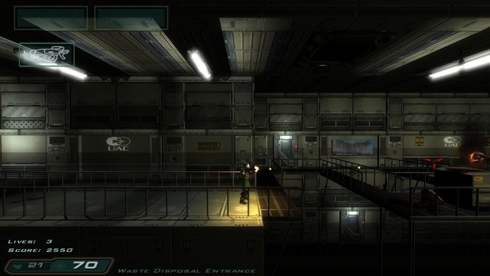

# Modifications for **dhewm3**

Unfortunately dhewm3 can't support all old Doom3 modifications, as it's incompatible with old Game DLLs.
This means that old Mods are only supported if they *either* have been ported to dhewm3
*or* don't require their own Game DLL (but are using the one from the main game).  
The essential requirement for porting Mods to dhewm3 is that the original Mod authors must
release the source code **under the GPLv3 license** (that id Software chose when open sourcing Doom3).
The [dhewm3 SDK project page](https://github.com/dhewm/dhewm3-sdk#how-to-port-a-mod-to-dhewm3) has more information.  
General information about idTech4 (Doom3, Quake4, Prey, ET:QW, ...) modding can be found at
the **[idTech4 ModWiki](https://modwiki.dhewm3.org)**.

# List of supported Mods

## Classic Doom 3

*Classic Doom 3* is a remake of the first episode of the original Doom in Doom3.

A big THANK YOU to "SnoopJeDi" (and the rest of the Classic Doom 3 Team) for releasing this mod under GPL!

* You can get the game data at [ModDB](https://www.moddb.com/downloads/classic-doom-3-131)
    - Just extract that zip to your Doom3/dhewm3 installation.
* You can find the source code at [Github](https://github.com/dhewm/dhewm3-sdk/tree/cdoom)
* A **.dll** that works with the official dhewm3 **Windows** executable is part of
  `dhewm3-mods_*_win32.zip` on the [Download Page](https://github.com/dhewm/dhewm3/releases/latest)
    - for other platforms you'll have to compile it yourself
* Once the game data and cdoom.dll/cdoom.so/cdoom.dylib are in place, you can start the mod with: 
  `./dhewm3 +set fs_game cdoom`

## Denton's Enhanced Doom3

This mod enhances the looks and sound of Doom3 and provides several new features for custom maps.

A big THANK YOU to "Clone JC Denton" for releasing his mod under GPL!

* You can get the game data at [ModDB](https://www.moddb.com/mods/dentons-enhanced-doom3-v202/downloads/dentons-enhanced-doom3-v2021)
    - Open that zip and extract the contained `Extract this to your doom3 folder.zip` to your Doom3/dhewm3 installation.
    - Especially if you're not on Windows, make sure to rename the contained `Dentonmod/` directory to `dentonmod/`,
      as doom3 doesn't like uppercase characters in paths (while it works on Windows,
      it doesn't on Linux, FreeBSD and possibly OSX!)
* You can find the source code at [Github](https://github.com/dhewm/dhewm3-sdk/tree/dentonmod)
* A **.dll** that works with the official dhewm3 **Windows** executable is part of
  `dhewm3-mods_*_win32.zip` on the [Download Page](https://github.com/dhewm/dhewm3/releases/latest)
    - for other platforms you'll have to compile it yourself
* Once the game data and dentonmod.dll/dentonmod.so/dentonmod.dylib are in place, you can start the mod with: 
  `./dhewm3 +set fs_game dentonmod`

## Fitz Packerton

Actually a small standalone game based on Doom3 GPL, so you don't even need the Doom3 game data to run this!

Fitz Packerton is *"A theatrical game about a man and the things he carries.
Pack what you must. Pray you won't need it."*

* You can get the game data at [https://teddydief.itch.io/fitz](https://teddydief.itch.io/fitz)
* You can find the source code at [Github](https://github.com/dhewm/dhewm3-sdk/tree/fitz)
* A **.dll** that works with the official dhewm3 **Windows** executable is part of
  `dhewm3-mods_*_win32.zip` on the [Download Page](https://github.com/dhewm/dhewm3/releases/latest)
    - for other platforms you'll have to compile it yourself
* Once the game data and dentonmod.dll/dentonmod.so/dentonmod.dylib are in place, you can start the mod with: 
  `./dhewm3 +set fs_game fitz`

## HardQore2

The *DOOM 3: HardQore* modification brings classic, fast paced, thumb blistering **side scrolling action** to Hell.  
If you're a fan of classic action games such as Contra & Metal Slug; then HardQore is what you have been waiting for.

Thanks a lot to Revility (and the rest of the HardQore2 team) for releasing
the source under GPL, so I could port it to dhewm3! :-)

* You can get the game data at:  
  [https://www.moddb.com/mods/hardqore/downloads/hardqore-2-demo](https://www.moddb.com/mods/hardqore/downloads/hardqore-2-demo)  
  and [https://www.moddb.com/mods/hardqore/downloads/hardqore-2-11-patch](https://www.moddb.com/mods/hardqore/downloads/hardqore-2-11-patch)  
  (yes, you need both!)
* You can find the source code at [Github](https://github.com/dhewm/dhewm3-sdk/tree/hardqore2)
* A **.dll** that works with the official dhewm3 **Windows** executable is part of
  `dhewm3-mods_*_win32.zip` on the [Download Page](https://github.com/dhewm/dhewm3/releases/latest)
    - for other platforms you'll have to compile it yourself
* Once the game data and hardqore2.dll/hardqore2.so/hardqore2.dylib are in place, you can start the mod with: 
  `./dhewm3 +set fs_game hardqore2`

## Scarlet Rivensin: The Ruiner

*Scarlet Rivensin: The Ruiner* (formerly known as just "Ruiner") is a dark, nightmarish,
third person action modification for Doom3 & dhewm 3.
The player assumes the role of a herald of Death & fights hordes of the damned using unique weapons, abilities and spells.

Thanks a lot to Revility (and the rest of the Rivensin/Ruiner team) for releasing the source under GPL!

* You can get the game data at [ModDB](https://www.moddb.com/mods/ruiner)
    - Just extract the dhewm3/rivensin subfolder of the .zip to your Doom3/dhewm3 installation.
* You can find the source code at [Github](https://github.com/dhewm/dhewm3-sdk/tree/rivensin)
* A **.dll** that works with the official dhewm3 **Windows** executable is part of
  `dhewm3-mods_*_win32.zip` on the [Download Page](https://github.com/dhewm/dhewm3/releases/latest)
    - Alternatively, the Rivensin downloads contain Windows binaries for dhewm3 and the Mod itself
    - for other platforms you'll have to compile it yourself
* Once the game data and rivensin.dll/rivensin.so/rivensin.dylib are in place, you can start the mod with: 
  `./dhewm3 +set fs_game rivensin`

<!-- TODO: Quadrilateral Cowboy ??? -->
