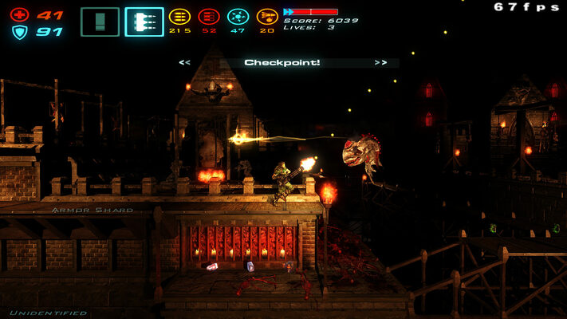

# Modifications for **dhewm3**

Unfortunately dhewm3 can't support all old Doom3 modifications, as it's incompatible with old Game DLLs.
This means that old Mods are only supported if they *either* have been ported to dhewm3
*or* don't require their own Game DLL (but are using the one from the main game).  
The essential requirement for porting Mods to dhewm3 is that the original Mod authors must
release the source code **under the GPLv3 license** (that id Software chose when open sourcing Doom3).
The [dhewm3 SDK project page](https://github.com/dhewm/dhewm3-sdk#how-to-port-a-mod-to-dhewm3) has more information.  
General information about idTech4 (Doom3, Quake4, Prey, ET:QW, ...) modding can be found at
the **[idTech4 ModWiki](https://modwiki.dhewm3.org)**.

**NOTE** that all mods *(except for Fitz Packerton, which is a standalon game)* **require the full version
of Doom3** (some also need the Resurrection of Evil addon, see the mod descriptions below for details).

# List of supported Mods

## Classic Doom 3

*Classic Doom 3* is a remake of the first episode of the original Doom in Doom3.

A big THANK YOU to "SnoopJeDi" (and the rest of the Classic Doom 3 Team) for releasing this mod under GPL!

* You can get the game data at [ModDB](https://www.moddb.com/downloads/classic-doom-3-131)
    - Just extract that zip to your Doom3/dhewm3 installation.
* You can find the source code at [Github](https://github.com/dhewm/dhewm3-sdk/tree/cdoom)
* A **.dll** that works with the official dhewm3 **Windows** executable and a **.so** for Linux
  (on amd64 aka x86_64) is part of `dhewm3-mods_*_win32.zip` resp. `dhewm3-mods_*_Linux_amd64.tar.gz`
  on the [Download Page](https://github.com/dhewm/dhewm3/releases/latest)
    - for other platforms you'll have to compile it yourself
* Once the game data and cdoom.dll/cdoom.so/cdoom.dylib are in place, you can start the mod with: 
  `./dhewm3 +set fs_game cdoom`

## Denton's Enhanced Doom3

This mod enhances the looks and sound of Doom3 and provides several new features for custom maps.

A big THANK YOU to "Clone JC Denton" for releasing his mod under GPL!

* You can get the game data at [ModDB](https://www.moddb.com/mods/dentons-enhanced-doom3-v202/downloads/dentons-enhanced-doom3-v2021)
    - Open that zip and extract the contained `Extract this to your doom3 folder.zip` to your Doom3/dhewm3 installation.
    - Especially if you're not on Windows, make sure to rename the contained `Dentonmod/` directory to `dentonmod/`,
      as doom3 doesn't like uppercase characters in paths (while it works on Windows,
      it doesn't on Linux, FreeBSD and possibly OSX!)
* You can find the source code at [Github](https://github.com/dhewm/dhewm3-sdk/tree/dentonmod)
* A **.dll** that works with the official dhewm3 **Windows** executable and a **.so** for Linux
  (on amd64 aka x86_64) is part of `dhewm3-mods_*_win32.zip` resp. `dhewm3-mods_*_Linux_amd64.tar.gz`
  on the [Download Page](https://github.com/dhewm/dhewm3/releases/latest)
    - for other platforms you'll have to compile it yourself
* Once the game data and dentonmod.dll/dentonmod.so/dentonmod.dylib are in place, you can start the mod with: 
  `./dhewm3 +set fs_game dentonmod`

## Fitz Packerton

Actually a small standalone game based on Doom3 GPL, so you don't even need the Doom3 game data to run this!

Fitz Packerton is *"A theatrical game about a man and the things he carries.
Pack what you must. Pray you won't need it."*

* You can get the game data at [https://teddydief.itch.io/fitz](https://teddydief.itch.io/fitz)
* You can find the source code at [Github](https://github.com/dhewm/dhewm3-sdk/tree/fitz)
* A **.dll** that works with the official dhewm3 **Windows** executable and a **.so** for Linux
  (on amd64 aka x86_64) is part of `dhewm3-mods_*_win32.zip` resp. `dhewm3-mods_*_Linux_amd64.tar.gz`
  on the [Download Page](https://github.com/dhewm/dhewm3/releases/latest)
    - for other platforms you'll have to compile it yourself
* Once the game data and fitz.dll/fitz.so/fitz.dylib are in place, you can start the mod with: 
  `./dhewm3 +set fs_game fitz`

## Hard Corps

The *DOOM 3: Hard Corps* is an enhanced/remastered version of the classic *HardQore2* mod for Doom3.  
It brings classic, fast paced, thumb blistering **side scrolling action** to Hell.  
If you're a fan of classic action games such as Contra & Metal Slug; then Hard Corps is what you have been waiting for.

Thanks a lot to Revility and Ivan_the_B (and the rest of the HardQore2 / Hard Corps team) 
for developing this Mod for dhewm3! :-)

* You can get the game data at: [https://www.moddb.com/mods/hardcorps/downloads](https://www.moddb.com/mods/hardcorps/downloads)
* You can find the source code at [Github](https://github.com/dhewm/dhewm3-sdk/tree/hardcorps)
* A **.dll** that works with the official dhewm3 **Windows** executable and a **.so** for Linux
  (on amd64 aka x86_64) is part of `dhewm3-hardcorps_1.5.1_win32.zip` resp. `dhewm3-hardcorps_1.5.1_Linux_amd64.tar.gz`
  on the [Download Page](https://github.com/dhewm/dhewm3/releases/tag/1.5.1)
    - for other platforms you'll have to compile it yourself
* Once the game data and hardcorps.dll/hardcorps.so/hardcorps.dylib are in place, you can start the mod with: 
  `./dhewm3 +set fs_game hardcorps`

## LibreCoop

LibreCoop is an open source coop mod for dhewm 3 supporting both the base game and the *Resurrection of Evil* Addon.

Thanks a lot to Stradex for developing this awesome mod that finally allows cooperative multiplayer in dhewm3!

* You can download the needed game data at [ModDB](https://www.moddb.com/mods/librecoop-dhewm3-coop)
* You can find the source at [the LibreCoop Github repo](https://github.com/Stradex/librecoop/)
* A **.dll** that works with the official dhewm3 **Windows** executable and a **.so** for Linux
  (on amd64 aka x86_64) is part of `dhewm3-mods_*_win32.zip` resp. `dhewm3-mods_*_Linux_amd64.tar.gz`
  on the [Download Page](https://github.com/dhewm/dhewm3/releases/latest)
    - for other platforms you'll have to compile it yourself
    - there's actually official downloads for Win32 and Linux on amd64, but dhewm3 provides
      DLLs/.so's anyway in case the official ones don't work on your system
* Once the game data and librecoop.dll/.so/.dylib and librecoopd3xp.dll/.so/dylib are in place,
  you can start the mod with:
    -  `./dhewm3 +set fs_game librecoop` for the main game or
    - `./dhewm3 +set fs_game_base d3xp +set fs_game librecoopd3xp` for *Resurrection of Evil*

## Scarlet Rivensin: The Ruiner

*Scarlet Rivensin: The Ruiner* (formerly known as just "Ruiner") is a dark, nightmarish,
third person action modification for Doom3 & dhewm 3.
The player assumes the role of a herald of Death & fights hordes of the damned using unique weapons, abilities and spells.

Thanks a lot to Revility (and the rest of the Rivensin/Ruiner team) for releasing the source under GPL!

* You can get the game data at [ModDB](https://www.moddb.com/mods/ruiner)
    - Just extract the dhewm3/rivensin subfolder of the .zip to your Doom3/dhewm3 installation.
* You can find the source code at [Github](https://github.com/dhewm/dhewm3-sdk/tree/rivensin)
* A **.dll** that works with the official dhewm3 **Windows** executable and a **.so** for Linux
  (on amd64 aka x86_64) is part of `dhewm3-mods_*_win32.zip` resp. `dhewm3-mods_*_Linux_amd64.tar.gz`
  on the [Download Page](https://github.com/dhewm/dhewm3/releases/latest)
    - Alternatively, the Rivensin downloads contain Windows binaries for dhewm3 and the Mod itself
    - for other platforms you'll have to compile it yourself
* Once the game data and rivensin.dll/rivensin.so/rivensin.dylib are in place, you can start the mod with: 
  `./dhewm3 +set fs_game rivensin`

## The Lost Mission

An entire new episode for Doom3!

Thanks a lot to Arl90 for releasing the source under GPL!

* You can get the gamedata at [ModDB](https://www.moddb.com/mods/the-lost-mission)
* You can find the source code at [Github](https://github.com/dhewm/dhewm3-sdk/tree/d3le)
* A **.dll** that works with the official dhewm3 **Windows** executable and a **.so** for Linux
  (on amd64 aka x86_64) is part of `dhewm3-mods_*_win32.zip` resp. `dhewm3-mods_*_Linux_amd64.tar.gz`
  on the [Download Page](https://github.com/dhewm/dhewm3/releases/latest)
    - for other platforms you'll have to compile it yourself

* **Note** that THIS MOD NEEDS the official "Resurrection of Evil" Addon (d3xp/) installed!

* Once the game data and d3le.dll/d3le.so/d3le.dylib are in place, you can start the mod with: 
  `./dhewm3 +set fs_game_base d3xp +set fs_game d3le`

